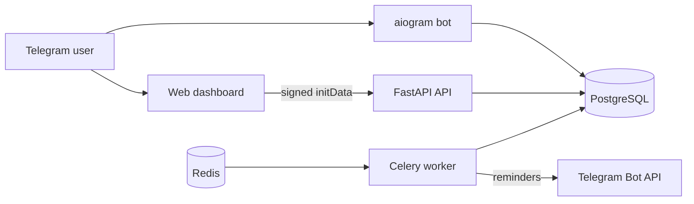

# TaskPilot

Telegram-first personal task manager with a bilingual web dashboard, smart reminders and productivity statistics.

[Open the bot](https://t.me/ka1zo1_bot) · [GitHub repository](https://github.com/ka1zo/taskpilot)

> Portfolio project: a production-oriented monorepo that demonstrates backend development, Telegram integrations, background jobs, authentication, database design, testing, containerization and frontend UX.

## What it does

- creates a task from a normal Telegram message;
- understands compact dates in Russian and English (`завтра 14:30`, `tomorrow 14:30`, `2026-12-20 09:15`);
- sends one-time reminders and a personalized daily digest;
- lets users complete tasks directly from Telegram;
- supports Russian and English per user;
- synchronizes tasks with a responsive light/dark web dashboard;
- protects web sessions by validating Telegram Mini App signatures;
- exposes documented FastAPI endpoints for tasks, categories and settings.

## Stack

| Layer | Technology |
| --- | --- |
| Bot | Python 3.12+, aiogram 3 |
| API | FastAPI, Pydantic, JWT |
| Data | PostgreSQL, SQLAlchemy 2, Alembic |
| Jobs | Celery, Redis |
| Web | React 19, TypeScript, Vinext, Tailwind CSS, shadcn/ui |
| Infrastructure | Docker Compose, GitHub Actions |
| Quality | pytest, Ruff, Oxlint |

## Architecture



## Quick start

Requirements: Docker Desktop and a Telegram bot token from [@BotFather](https://t.me/BotFather).

1. Copy `.env.example` to `.env`.
2. Set `BOT_TOKEN`, `BOT_USERNAME` and a strong `SECRET_KEY`.
3. Start the stack:

   ```bash
   docker compose up --build
   ```

4. Open API documentation at `http://localhost:8000/docs`.
5. Open the dashboard at `http://localhost:3000` when running the web package locally.

For database migrations in a deployed environment:

```bash
docker compose run --rm api alembic upgrade head
```

## Bot commands

| Command | Description |
| --- | --- |
| `/start` | Onboarding and language selection |
| `/new <task>` | Create a task explicitly |
| `/today` | Tasks due today |
| `/tasks` | All active tasks |
| `/language` | Switch Russian/English |
| `/settings` | Current timezone and digest hour |
| `/help` | Usage examples |

Users can also send a plain message such as `Оплатить интернет завтра 19:00`.

## API authentication

The web client sends Telegram Mini App `initData` to `POST /api/v1/auth/telegram`. The backend validates its HMAC signature and age before issuing a short-lived JWT. `X-Telegram-User-Id` is available only when `DEV_AUTH_ENABLED=true` and must be disabled in production.

## Repository layout

```text
taskpilot/
├── apps/
│   ├── api/          # FastAPI, bot, worker, migrations and tests
│   └── web/          # responsive bilingual dashboard
├── docs/             # ready-to-use portfolio copy
├── .github/workflows # CI for backend and frontend
├── docker-compose.yml
└── .env.example
```

## Tests

```bash
cd apps/api
python -m pip install -e ".[dev]"
ruff check .
pytest
```

The test suite covers natural-language task parsing, Telegram signature validation and the API health endpoint. GitHub Actions runs backend and web checks on every push and pull request.

## Deployment plan

- **Web:** Cloudflare/OpenAI Sites or another Node-compatible host.
- **API, bot and workers:** a VPS, Railway, Render or Fly.io using the Docker image.
- **Database:** managed PostgreSQL.
- **Queue:** managed Redis.

Set the production web URL in `WEB_APP_URL`, allow it in `CORS_ORIGINS`, and configure the Mini App URL through BotFather. Never commit `.env`.

## Roadmap

- recurring-task materialization;
- timezone picker and digest settings in the dashboard;
- advanced search and category filters;
- CSV/JSON export;
- rate limiting and observability;
- end-to-end tests for the Telegram Mini App flow.

## License

[MIT](LICENSE)
